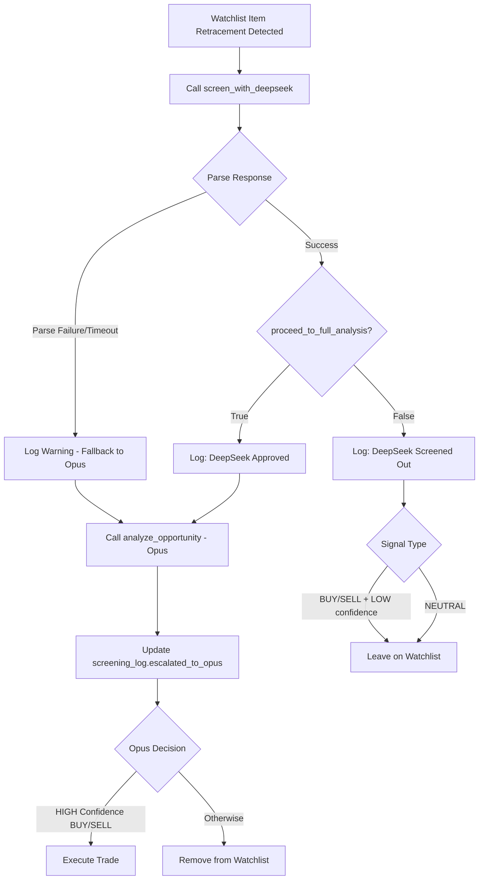

# DeepSeek R1 Screening Layer Implementation Plan

## Overview

Add DeepSeek R1 (Free) as a pre-screening layer before Opus is queried. DeepSeek
must approve the trade first — only a clear BUY or SELL from DeepSeek triggers
an Opus call. This replaces the current direct-to-Opus flow in
`check_watchlist_item()`.

## Architecture



## Implementation Details

### 1. Config Changes - [`files/config.py`](files/config.py)

Add the following constants after the existing API keys section:

```python
# --- OpenRouter API for DeepSeek Screening ---
OPENROUTER_API_KEY = os.getenv("OPENROUTER_API_KEY")
OPENROUTER_BASE_URL = "https://openrouter.ai/api/v1"
DEEPSEEK_MODEL = "deepseek/deepseek-r1-0528:free"
DEEPSEEK_TIMEOUT = 30  # seconds — free tier can be slow
```

### 2. Database Changes - [`files/database.py`](files/database.py)

#### 2.1 New Table: `screening_log`

Add to `_init_db()` method:

```sql
CREATE TABLE IF NOT EXISTS screening_log (
    id TEXT PRIMARY KEY,
    timestamp REAL,
    symbol TEXT,
    timeframe TEXT,
    model TEXT,
    signal TEXT,
    confidence TEXT,
    reasoning TEXT,
    proceed INTEGER,
    prompt_tokens INTEGER,
    completion_tokens INTEGER,
    raw_response TEXT,
    escalated_to_opus INTEGER DEFAULT 0
)
```

#### 2.2 New Method: `log_screening(data)`

Inserts a screening result row. Parameters:

- `id`: Unique identifier (timestamp-based)
- `timestamp`: Unix timestamp
- `symbol`: Trading pair
- `timeframe`: daily/weekly
- `model`: Model identifier
- `signal`: BUY/SELL/NEUTRAL
- `confidence`: HIGH/MEDIUM/LOW
- `reasoning`: Brief explanation
- `proceed`: 0 or 1 boolean
- `prompt_tokens`: Token count
- `completion_tokens`: Token count
- `raw_response`: Full JSON response string

Returns: `screening_id` for later escalation update.

#### 2.3 New Method: `update_screening_escalated(screening_id)`

Sets `escalated_to_opus = 1` for the given screening ID. Called only when Opus
is actually triggered.

### 3. LLM Client Changes - [`files/llm_client.py`](files/llm_client.py)

#### 3.1 New Method: `screen_with_deepseek(symbol, timeframe, market_data_dict, context_extras)`

**Request Details:**

- Endpoint: `https://openrouter.ai/api/v1/chat/completions`
- Method: POST via `urllib.request` (no new dependencies)
- Headers:
  - `Authorization: Bearer {OPENROUTER_API_KEY}`
  - `HTTP-Referer: imbalance-trading-bot`
  - `X-Title: Imbalance Bot`
  - `Content-Type: application/json`
- Timeout: `Config.DEEPSEEK_TIMEOUT` (30 seconds)

**Request Body:**

```json
{
    "model": "deepseek/deepseek-r1-0528:free",
    "messages": [
        { "role": "system", "content": "<shortened system prompt>" },
        { "role": "user", "content": "<formatted market data>" }
    ]
}
```

**System Prompt (Shortened for Screening):**

```
You are a quick screener for cryptocurrency trade setups. Analyze the market data briefly and determine if this setup warrants full analysis.

Focus on:
1. Is there a clear imbalance zone (FVG or Order Block)?
2. Has price retraced into the zone?
3. Is the risk/reward favorable?

Return ONLY valid JSON:
{
  "signal": "BUY" | "SELL" | "NEUTRAL",
  "confidence": "HIGH" | "MEDIUM" | "LOW",
  "reasoning": "1-2 sentences max",
  "proceed_to_full_analysis": true | false
}

Rules:
- proceed_to_full_analysis = true ONLY when signal is BUY or SELL AND confidence is HIGH or MEDIUM
- If unclear or no clear setup, return NEUTRAL with proceed_to_full_analysis = false
```

**Response Parsing:**

1. DeepSeek R1 uses a `<think\>` block before its answer
2. Strip everything up to and including the closing `</think\>` tag
3. Use `find('{')` and `rfind('}')` approach (same as `analyze_opportunity()`)
4. Parse the JSON response

**Error Handling:**

- On timeout: Log warning, return `proceed_to_full_analysis: true` (fallback to
  Opus)
- On parse failure: Log warning, return `proceed_to_full_analysis: true`
- If `OPENROUTER_API_KEY` not set: Log warning, return
  `proceed_to_full_analysis: true`

**Token Logging:**

- Log token usage via `logger.info()` with `usage.prompt_tokens` and
  `usage.completion_tokens`
- Do NOT call `_track_cost()` (DeepSeek via OpenRouter is free)

**Return Value:**

```python
{
    "signal": "BUY" | "SELL" | "NEUTRAL",
    "confidence": "HIGH" | "MEDIUM" | "LOW",
    "reasoning": "Brief explanation",
    "proceed_to_full_analysis": True | False,
    "screening_id": "timestamp_based_id"  # For later escalation update
}
```

### 4. Strategy Changes - [`files/strategy.py`](files/strategy.py)

#### 4.1 Update `check_watchlist_item(opp)` Method

Replace the current direct `self.llm.analyze_opportunity()` call with this
two-stage flow:

```python
def check_watchlist_item(self, opp):
    symbol = opp['symbol']
    tf_name = opp['timeframe']
    
    df_dict = self.market_data.get_multi_timeframe_data(symbol, tf_name)
    if not df_dict or df_dict['primary'] is None:
        return

    current_candle = df_dict['primary'].iloc[-1]
    
    if self.tracker.check_retracement(symbol, tf_name, current_candle):
        logger.info(f"⚡ Triggering Analysis for {symbol} ({tf_name}) - Retracement Confirmed")
        
        # Prepare context
        primary_df = df_dict['primary']
        regime = self.market_data.detect_market_regime(primary_df)
        sr_levels = self.market_data.identify_support_resistance(primary_df)
        context_extras = {
            'regime': regime,
            'sr_levels': sr_levels
        }
        
        # === NEW: Stage 1 - DeepSeek Screening ===
        screening = self.llm.screen_with_deepseek(symbol, tf_name, df_dict, context_extras)
        
        if not screening:
            logger.warning(f"⚠️ DeepSeek screening failed for {symbol} - falling back to Opus")
            # Fallback to Opus on complete failure
            screening = {"proceed_to_full_analysis": True}
        
        # Log screening result
        screening_id = screening.get('screening_id')
        self.db.log_screening({
            'id': screening_id,
            'symbol': symbol,
            'timeframe': tf_name,
            'model': Config.DEEPSEEK_MODEL,
            'signal': screening.get('signal', 'NEUTRAL'),
            'confidence': screening.get('confidence', 'LOW'),
            'reasoning': screening.get('reasoning', ''),
            'proceed': 1 if screening.get('proceed_to_full_analysis') else 0,
            'prompt_tokens': screening.get('prompt_tokens', 0),
            'completion_tokens': screening.get('completion_tokens', 0),
            'raw_response': screening.get('raw_response', '')
        })
        
        # Log reasoning
        reasoning = screening.get('reasoning', 'No reasoning provided')
        logger.info(f"💬 DeepSeek ({symbol}): {reasoning}")
        
        # Check if we should proceed
        if not screening.get('proceed_to_full_analysis'):
            signal = screening.get('signal', 'NEUTRAL')
            confidence = screening.get('confidence', 'LOW')
            logger.info(f"⏭️ DeepSeek screened out {symbol} ({signal} / {confidence}) - Opus skipped")
            
            # Leave on watchlist if NEUTRAL or LOW confidence BUY/SELL
            if signal == 'NEUTRAL':
                pass  # Keep watching
            elif confidence == 'LOW':
                pass  # Keep watching, might improve
            else:
                # Shouldn't happen given proceed logic, but handle it
                self.tracker.remove_opportunity(symbol, tf_name)
            return
        
        # === Stage 2 - Opus Analysis ===
        logger.info(f"🔍 DeepSeek approved {symbol} ({screening.get('signal')} / {screening.get('confidence')}) - escalating to Opus")
        
        analysis = self.llm.analyze_opportunity(symbol, tf_name, df_dict, context_extras)
        
        # Update screening log that we escalated
        if screening_id:
            self.db.update_screening_escalated(screening_id)
        
        if not analysis:
            return
            
        if analysis.get("signal") in ["BUY", "SELL"] and analysis.get("confidence") == "HIGH":
            self.execute_trade(symbol, tf_name, analysis, context_extras)
            self.tracker.remove_opportunity(symbol, tf_name)
        else:
            logger.info(f"Opus rejected {symbol}: {analysis.get('reasoning')}")
            if analysis.get("signal") != "NEUTRAL":
                self.tracker.remove_opportunity(symbol, tf_name)
```

### 5. Test Changes - [`tests/test_strategy_flow.py`](tests/test_strategy_flow.py)

The test file should NOT be modified per requirements. Instead, the existing
mock pattern for `analyze_opportunity` should be extended to also mock
`screen_with_deepseek`:

```python
# In setUp():
self.mock_llm.screen_with_deepseek = MagicMock()

# In test_end_to_end_flow():
self.mock_llm.screen_with_deepseek.return_value = {
    "signal": "BUY",
    "confidence": "HIGH",
    "reasoning": "Good setup",
    "proceed_to_full_analysis": True,
    "screening_id": "test_screening_123"
}
```

## Logging Standards

All screening events use `logger.info()` with these prefixes:

| Prefix | Meaning                           |
| ------ | --------------------------------- |
| ⏭️     | Screened out, Opus skipped        |
| 🔍     | Approved, escalating to Opus      |
| ⚠️     | Parse failure or timeout fallback |
| 💬     | Reasoning output                  |

Example logs:

```
💬 DeepSeek (BTC/USDT): Strong bullish FVG with 60% retracement, favorable R:R
🔍 DeepSeek approved BTC/USDT (BUY / HIGH) - escalating to Opus
⏭️ DeepSeek screened out ETH/USDT (NEUTRAL / LOW) - Opus skipped
⚠️ DeepSeek screening failed for SOL/USDT - falling back to Opus
```

## Environment Variables

Add to `.env`:

```
OPENROUTER_API_KEY=your_openrouter_api_key_here
```

## Constraints Checklist

- [x] Use `urllib.request` only — no `requests` library or new pip dependencies
- [x] Enforce `Config.DEEPSEEK_TIMEOUT` on HTTP calls
- [x] Fallback to Opus if `OPENROUTER_API_KEY` not set
- [x] Do NOT modify `test_strategy_flow.py` — mock `screen_with_deepseek` the
      same way `analyze_opportunity` is mocked
- [x] DeepSeek R1 `<think\>` block handling with strip logic
- [x] No cost tracking for DeepSeek (free tier)
- [x] Token usage logging without cost calculation

## File Changes Summary

| File                                                         | Changes                                                                      |
| ------------------------------------------------------------ | ---------------------------------------------------------------------------- |
| [`files/config.py`](files/config.py)                         | Add OpenRouter config constants                                              |
| [`files/database.py`](files/database.py)                     | Add `screening_log` table, `log_screening()`, `update_screening_escalated()` |
| [`files/llm_client.py`](files/llm_client.py)                 | Add `screen_with_deepseek()` method                                          |
| [`files/strategy.py`](files/strategy.py)                     | Update `check_watchlist_item()` with two-stage flow                          |
| `.env`                                                       | Add `OPENROUTER_API_KEY`                                                     |
| [`tests/test_strategy_flow.py`](tests/test_strategy_flow.py) | No changes — mock pattern already supports new method                        |

## Implementation Order

1. **Config** — Add constants first (no dependencies)
2. **Database** — Add table and methods (depends on config)
3. **LLM Client** — Add screening method (depends on config)
4. **Strategy** — Update pipeline flow (depends on all above)
5. **Testing** — Verify with existing test infrastructure
