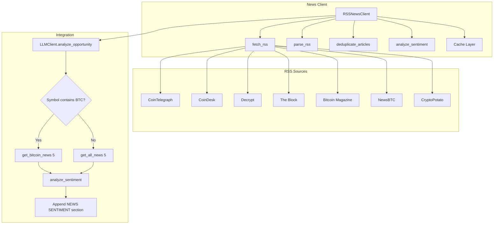

# RSS News Feed Integration Plan

## Overview

Add a Python RSS news client to the existing trading bot, ported from the
reference Node.js implementation. The goal is to provide news sentiment context
to the LLM during opportunity analysis.

## Architecture



## File Structure

```
files/
├── news_client.py      # NEW: RSSNewsClient class
├── llm_client.py       # MODIFIED: integrate news sentiment
├── config.py           # EXISTING: may add news config if needed
└── ...
```

## Implementation Details

### 1. RSSNewsClient Class - files/news_client.py

#### 1.1 RSS Sources Configuration

Same 7 sources as the JS reference:

| Source          | URL                                     | Name             |
| --------------- | --------------------------------------- | ---------------- |
| cointelegraph   | cointelegraph.com/rss                   | CoinTelegraph    |
| coindesk        | www.coindesk.com/arc/outboundfeeds/rss/ | CoinDesk         |
| decrypt         | decrypt.co/feed                         | Decrypt          |
| theblock        | www.theblock.co/rss.xml                 | The Block        |
| bitcoinmagazine | bitcoinmagazine.com/.rss/full/          | Bitcoin Magazine |
| newsbtc         | www.newsbtc.com/feed/                   | NewsBTC          |
| cryptopotato    | cryptopotato.com/feed/                  | CryptoPotato     |

#### 1.2 Class Structure

```python
class RSSNewsClient:
    def __init__(self, cache_expiry_ms=5*60*1000, breaking_news_age_ms=2*60*60*1000):
        self._cache = {}
        self._cache_expiry_ms = cache_expiry_ms
        self._breaking_news_age_ms = breaking_news_age_ms
    
    # Public Methods
    def get_all_news(self, limit=10) -> dict
    def get_bitcoin_news(self, limit=10) -> dict
    def get_breaking_news(self, limit=10) -> dict
    def analyze_sentiment(self, articles) -> dict
    
    # Private Methods
    def _fetch_rss(self, url) -> str        # HTTP GET with 10s timeout
    def _parse_rss(self, xml, source_name) -> list
    def _fetch_source(self, source_key) -> list
    def _deduplicate_articles(self, articles) -> list
    def _title_similarity(self, title1, title2) -> float  # Jaccard
```

#### 1.3 Key Implementation Details

**RSS Fetching - _fetch_rss:**

- Use `urllib.request` with 10 second timeout per source
- Set User-Agent header to avoid blocking
- Wrap in try/except - return empty string on failure, log warning
- Use `concurrent.futures.ThreadPoolExecutor` for parallel fetches

**XML Parsing - _parse_rss:**

- Use regex-based parsing like JS reference for robustness
- Handle both `<item>` and `<entry>` tags
- Handle CDATA sections: `<![CDATA[...]]>`
- Extract fields with fallbacks:
  - title
  - link (fallback: guid)
  - pubDate (fallback: published, updated)
  - description (fallback: summary, content:encoded)

**Deduplication - _deduplicate_articles:**

- Jaccard similarity on normalized titles
- Normalize: lowercase, remove non-word chars, split on whitespace, filter words
  > 3 chars
- Threshold: 0.8 similarity = duplicate
- Keep first occurrence

**Cache:**

- In-memory dict with timestamp
- Key: `all_{limit}`, `bitcoin_{limit}`, etc.
- 5-minute expiry (300,000 ms)
- Check timestamp before fetching

**Sentiment Analysis - analyze_sentiment:**

- Same keyword lists as JS reference:
  - Bullish: surge, rally, bullish, breakout, gains, soar, pump, moon, adoption,
    breakthrough, positive, upgrade, partnership, institutional, accumulation
  - Bearish: crash, plunge, bearish, dump, decline, drop, sell-off, correction,
    fear, regulation, hack, scam, fraud, ban, negative, warning
- Count matches in title + description
- Return:
  ```python
  {
      'overallSentiment': 'BULLISH' | 'BEARISH' | 'NEUTRAL',
      'confidence': 'HIGH' | 'MEDIUM' | 'LOW',
      'bullishPercent': int,
      'bearishPercent': int,
      'neutralPercent': int,
      'articleCount': int,
      'breakdown': {'bullish': int, 'bearish': int, 'neutral': int}
  }
  ```

### 2. LLM Client Integration - files/llm_client.py

#### 2.1 Modifications to LLMClient.**init**

```python
def __init__(self, state_manager, news_client=None):
    self.client = anthropic.Anthropic(api_key=Config.ANTHROPIC_API_KEY)
    self.state_manager = state_manager
    self.news_client = news_client  # Optional injection
    # ... rest of init
```

#### 2.2 Modifications to analyze_opportunity

Add news sentiment fetching and append to user_message:

```python
def analyze_opportunity(self, symbol, timeframe, market_data_dict, context_extras=None):
    # ... existing code ...
    
    # Fetch news sentiment (non-blocking with 15s total timeout)
    news_section = ""
    if self.news_client:
        try:
            news_result = self._fetch_news_with_timeout(symbol, timeout=15)
            if news_result:
                sentiment = self.news_client.analyze_sentiment(news_result['articles'])
                news_section = self._format_news_section(news_result['articles'], sentiment)
        except Exception as e:
            logger.warning(f"News fetch failed, continuing without: {e}")
    
    user_message = f"Analyze this market data for {symbol} ({timeframe}):\nPRIMARY TIMEFRAME:\n{primary_csv}{context_str}{extras_str}{news_section}"
    # ... rest of method
```

#### 2.3 Helper Methods

```python
def _fetch_news_with_timeout(self, symbol, timeout=15):
    """Fetch news with total timeout to avoid blocking trade execution."""
    # Use ThreadPoolExecutor with 15s total timeout
    # If symbol contains BTC, get_bitcoin_news, else get_all_news
    
def _format_news_section(self, articles, sentiment):
    """Format news sentiment section for LLM prompt."""
    # Format:
    # NEWS SENTIMENT (last N articles):
    # Overall: BULLISH (HIGH confidence) | 70% bullish, 20% bearish
    # Headlines:
    # - [headline 1] (CoinDesk)
    # - [headline 2] (CoinTelegraph)
```

### 3. Strategy Integration - files/strategy.py

Update the strategy to pass news_client to LLMClient:

```python
def __init__(self):
    # ... existing init ...
    self.news_client = RSSNewsClient()  # Create news client
    self.llm = LLMClient(self.state, news_client=self.news_client)  # Inject
```

## Error Handling

1. **Per-source failures**: Log warning, return empty list, continue with other
   sources
2. **Total timeout**: 15s max - if exceeded, skip news silently
3. **Parse failures**: Log warning, skip malformed articles
4. **No articles**: Return empty result, sentiment analysis returns LOW
   confidence

## Testing Strategy

1. Unit test RSSNewsClient methods independently
2. Mock HTTP responses for consistent testing
3. Test deduplication with known duplicate titles
4. Test sentiment analysis with known bullish/bearish headlines
5. Integration test with LLMClient

## Dependencies

**Python Standard Library Only:**

- `urllib.request` - HTTP requests
- `urllib.error` - Error handling
- `xml.etree.ElementTree` or `re` - XML parsing (using regex like JS)
- `concurrent.futures` - ThreadPoolExecutor for parallel fetches
- `threading` - Thread safety if needed
- `logging` - Logging
- `datetime` - Timestamp handling
- `time` - Time operations

No new pip dependencies required.

## Code Style

Following existing repo conventions:

- snake_case for methods and variables
- `logger = logging.getLogger(__name__)` at module level
- Config class pattern for constants
- Type hints in docstrings
- Comprehensive error handling with logging
